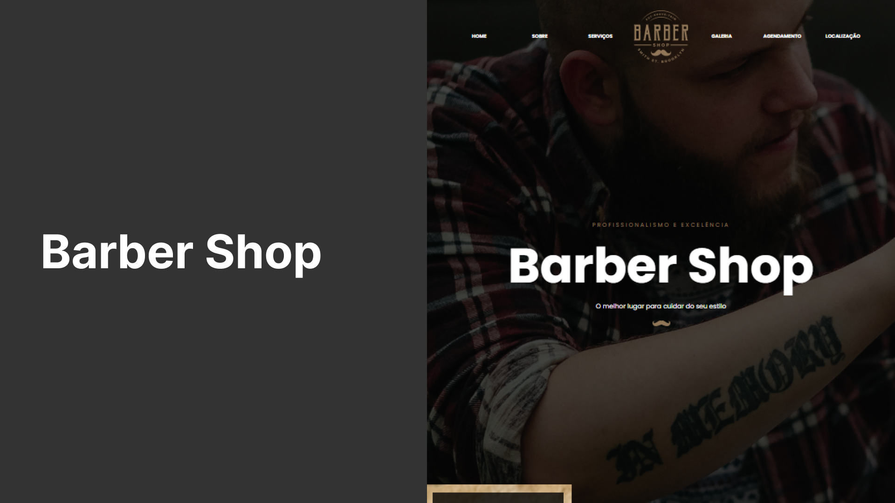

# 💈 Barber Shop  

  

## 📖 Sobre o Projeto  

O **Barber Shop** é um site desenvolvido com **HTML e CSS**, pensado para apresentar de forma moderna e profissional uma barbearia fictícia.  
O objetivo foi criar uma **página completa, responsiva e intuitiva**, destacando os principais serviços e informações que um cliente precisa ao procurar uma barbearia.  

Entre as seções do site, estão:  

- 🏠 **Home**: Banner de destaque com slogan e logotipo.  
- 📖 **Sobre**: História da barbearia e seus anos de experiência.  
- ✂️ **Serviços**: Apresentação dos serviços oferecidos.  
- 📅 **Agendamento**: Formulário simples para marcação de horário.  
- 🖼️ **Galeria**: Exibição de fotos da barbearia e seus trabalhos.  
- 📍 **Localização**: Informações de contato e mapa integrado do Google Maps.  
- 📢 **Rodapé**: Direitos autorais e identidade visual.  

---

## 🚀 Tecnologias Utilizadas  

- **HTML5**  
- **CSS3**  
- **Google Fonts**  
- **Google Maps Embed API**  

---

## ✨ Destaques  

✔️ Layout moderno e responsivo  
✔️ Estrutura clara e organizada  
✔️ Integração com Google Maps  
✔️ Seções essenciais para apresentação de negócios locais  

---

## 🔗 Links do Projeto  

- 🌍 Projeto Online: [GitHub Pages](https://thamiressarges.github.io/barber-shop)  
